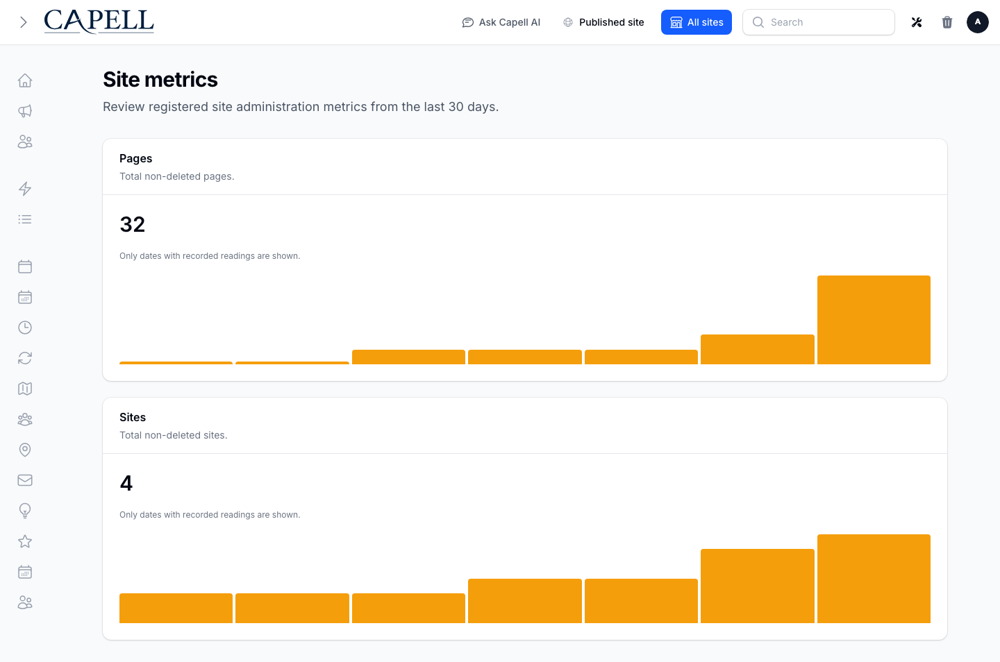

# Site Stats

<!-- prettier-ignore-start -->

## What This Plugin Adds

Site Stats is an **Available**, **No schema impact** Capell package in the **Capell Foundation** product group. It ships as `capell-app/site-stats` and extends these surfaces: shared.

Site Stats registers privacy-safe current-day page, site, active site, and active domain totals with Capell's typed metrics pipeline.

Authorized global administrators can inspect four retained content-inventory trends through a consuming Core metrics surface without collecting visitor analytics.

Evidence: [`src/Metrics/ContentTotalsMetricsCollector.php`](src/Metrics/ContentTotalsMetricsCollector.php), [`src/Providers/SiteStatsServiceProvider.php`](src/Providers/SiteStatsServiceProvider.php), [`tests/Unit/Metrics/ContentTotalsMetricsCollectorTest.php`](tests/Unit/Metrics/ContentTotalsMetricsCollectorTest.php), [`docs/screenshots/site-stats-metrics-dashboard.png`](docs/screenshots/site-stats-metrics-dashboard.png), [`src/Health/SiteStatsHealthCheck.php`](src/Health/SiteStatsHealthCheck.php), [`tests/Feature/ScreenshotFixtureRouteTest.php`](tests/Feature/ScreenshotFixtureRouteTest.php).

Status details:

- Status: Available
- Tier: free
- Bundle: foundation
- Composer package: `capell-app/site-stats`
- Namespace: `Capell\SiteStats`
- Theme key: not applicable

## Why It Matters

**For developers:** The collector uses Core metric definitions, scopes, governance, and daily rollups rather than introducing a package-specific reporting store.

**For teams:** Teams get a simple retained view of content growth without page-view tracking, request logging, or a second analytics dashboard.

Evidence: [`src/Metrics/ContentTotalsMetricsCollector.php`](src/Metrics/ContentTotalsMetricsCollector.php), [`tests/Unit/ManifestRequirementsTest.php`](tests/Unit/ManifestRequirementsTest.php), [`tests/Feature/ScreenshotFixtureRouteTest.php`](tests/Feature/ScreenshotFixtureRouteTest.php).

## Screens And Workflow

Screenshot contract: `docs/screenshots.json`.

- Site Stats content totals in the Core metrics dashboard (admin, supplementary documentation fixture).
- Site Stats content totals in the Core metrics dashboard with admin sidebar menu open (admin, supplementary documentation fixture).

## Technical Shape

### Service providers

- `Capell\SiteStats\Providers\SiteStatsServiceProvider`

### Manifest contributions

- `health-check: Capell\SiteStats\Health\SiteStatsHealthCheck`

### Health checks

- `Capell\SiteStats\Health\SiteStatsHealthCheck`

### Cache tags

- `site-stats`

## Data Model

- Required tables: `pages`, `sites`, `site_domains`.
- Migration impact: run host migrations through the package install flow before opening package surfaces.
- Deletion/retention behaviour: Docs gap: migrations and manifest contributions do not prove a cascade, pruning command, or timed retention policy.

## Install Impact

- Required packages: `capell-app/core`.
- Admin navigation: no admin page or resource contribution is declared.
- Admin/editor extensions: none declared.
- Permissions: no package permission declarations or Shield gates detected; host access rules still apply.
- Public routes: none declared.
- Database changes: no package migrations declared.
- Config: no package config files.
- Settings: no package settings declared.
- Queues or schedules: none declared.
- Cache tags: `site-stats`.
- Commands: none declared.

## Common Pitfalls

- Keep required Capell packages on compatible v4 releases: `capell-app/core`.
- Custom write integrations must preserve invalidation for `site-stats` cache tags.

## Troubleshooting

| Symptom | Likely cause | Check | Fix |
| --- | --- | --- | --- |
| Package surface is missing after install | Provider or manifest is not loaded | Confirm `capell.json`, package `composer.json`, and provider registration | Reinstall the package, refresh Composer autoload, and clear host caches |

## Quick Start

1. Install the package: `composer require capell-app/site-stats`.
2. Verify the package provider and manifest contributions are registered in the host app.

## Next Steps

- [Package docs](docs/README.md)
- [Overview](docs/overview.md)
- [Troubleshooting](#troubleshooting)
- [Screenshot contract](docs/screenshots.json)
- [Marketplace assets](docs/assets/marketplace/)
- [Capell content language plan](../../docs/CONTENT_LANGUAGE_PLAN.md)
- [Capell documentation design system](../../docs/DESIGN_SYSTEM.md)
- [Capell and package ERD notes](../../docs/erd/capell-and-package-erds.md)
- Focused tests: `vendor/bin/pest packages/site-stats/tests --configuration=phpunit.xml`.

<!-- prettier-ignore-end -->
